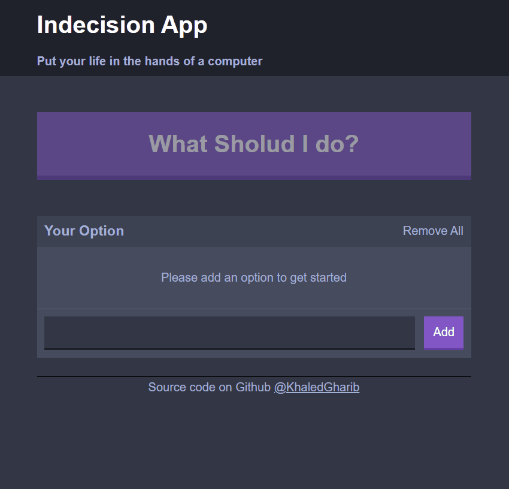

<p align="center">
  <a href="#key-features">Key Features</a> •
  <a href="#how-to-use">How To Use</a> •
  <a href="#How-it's-work?">How it's work?</a> •
  <a href="#credits">Credits</a> •
</p>
<p align="center">
    
      
    


</p>



## [Live demo]('https://xed-indecision-app.netlify.app/')✨

## How it's work?

Well, it's simply taking tasks from user and when clicking on the big button it's randomly choosing between tasks and popup them. What about saving tasks🧐? it's stored in local memory in the browser, so when the user comeback the tasks will be there watting to picked up 😇 until the user deletes them 😢 However take a look at the app 👇

## How To Use

To clone and run this application, you'll need [Git](https://git-scm.com) and you are ready to use it !

```bash
# Clone this repository
$ git clone git@github.com:KhaledGharib/indecision-App.git

# Go into the repository
$ cd indecision-App

# Install dependencies
$ npm install

# Run build
$ npm run build

# Run the server
$ npm run server
```

> **Or you can use `npm run dev-server`**
